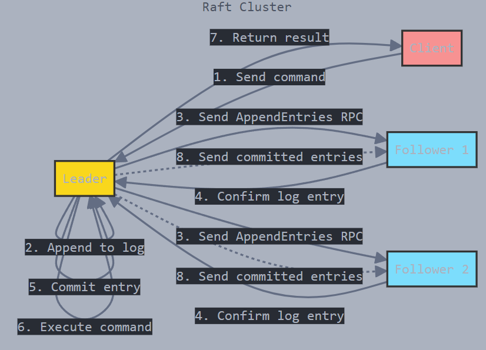

# Go-raft:Raft Consensus Algorithm Implementation in Go

This project is an implementation of the [Raft consensus algorithm](https://raft.github.io/) in Go for total order Broadcasting. It allows distributed systems to achieve consensus across multiple nodes, ensuring reliable data replication. The algorithm is particularly useful for ensuring leader election and maintaining a replicated log across distributed systems.

## here is my go-raft's  demo video:

[](https://youtu.be/G2I4g0kFN8M)

## Features

- Follower, Candidate, and Leader states
- Leader election with timeouts
- Heartbeat mechanism to maintain leadership
- Log replication (if implemented)
- Graceful node shutdown
- Go routines and channels for concurrency

## Getting Started


### Prerequisites

- [Go](https://golang.org/doc/install) 1.19 or higher

### Installation

1. Clone the repository:

    ```bash
    git clone https://github.com/thevoid12/go-raft.git
    cd go-raft
    ```

2. Run the application:

    ```bash
      # we have 5 nodes so start nodes in 5 terminal
      # Terminal 1
    ./go-raft -id=1 -addr=localhost:8001

      # Terminal 2
    ./go-raft -id=2 -addr=localhost:8002

    # Terminal 3
    ./go-raft -id=3 -addr=localhost:8003

    # Terminal 4
    ./go-raft -id=4 -addr=localhost:8004

    # Terminal 5
    ./go-raft -id=5 -addr=localhost:8005
    ```

## Endpoints
### 1. `/client` (RequestVote RPC)
**Method**: `POST`  
**Description**:  
set value into the leader node. once set it is replicated across all node. when a inactive node comes back into the network the value automatically replicated


**Example**:
```bash
curl -X POST -H "Content-Type: application/json" -d '{"command":"set x=1"}' http://localhost:8001/client #where 8001 is the leader

```

---


### 2. `/request_vote` (RequestVote RPC)
**Method**: `POST`  
**Description**:  
This ineternal endpoint is called when a candidate node requests votes from other nodes during an election. It carries details such as the candidate's term, the candidate's ID, and the state of the candidate’s log. A node receiving this request will decide whether to grant its vote based on its current state and the log's consistency.

**Request Body**:
```json
{
  "term": int,
  "candidate_id": int,
  "last_log_index": int,
  "last_log_term": int
}
```

**Response**:
```json
{
  "term": int,
  "vote_granted": bool
}
```

**Behavior**:
- If the term in the request is lower than the node’s current term, the vote is rejected.
- If the term is higher, the node updates its term and steps down to the Follower state, granting the vote.
- Votes are granted if the node hasn't voted yet or if it voted for this candidate and the candidate’s log is at least as up-to-date as the node's log.

---

### 3. `/append_entries` (AppendEntries RPC - Heartbeats)
**Method**: `POST`  
**Description**:  
This endpoint is used by the leader node to send heartbeats to its followers or to append log entries to the follower nodes. The leader regularly sends heartbeats to maintain its leadership and synchronize log entries with its followers.

**Request Body**:
```json
{
  "term": int,
  "leader_id": int,
  "prev_log_index": int,
  "prev_log_term": int,
  "entries": [LogEntry],
  "leader_commit": int
}
```

**Response**:
```json
{
  "term": int,
  "success": bool,
  "match_index": int
}
```

**Behavior**:
- If the term in the request is lower than the node’s current term, the append request is rejected.
- If the term is higher, the node updates its term, steps down to the Follower state, and resets its election timeout.
- The node checks the consistency of the log and appends any new log entries from the leader. It also applies committed entries to the state machine.

---

### 4. `/inspect`
**Method**: `GET`  
**Description**:  
This endpoint returns the current status of the node, including its state (Follower, Candidate, or Leader), current term, log entries,latest state etc

**Response**:
```json
{
    "state": "Follower" | "Candidate" | "Leader",
    "current_term": <int>,
    "voted_for": <int>,
    "commit_index": <int>,
    "last_applied": <int>,
    "log_entries": [
        {
            "term": <int>,
            "index": <int>,
            "command": <string>
        }
    ],
    "state_machine": {
        "latest-key1": "latest-value1",
    }
}
```

**Behavior**:  
Useful for monitoring and checking the status of the node in the cluster.

**Example Usage**:
```bash
curl http://localhost:8001/inspect
curl http://localhost:8002/inspect
curl http://localhost:8003/inspect
curl http://localhost:8004/inspect
curl http://localhost:8005/inspect
```
---

### Usage

The project allows you to simulate a distributed system with nodes that communicate using the Raft consensus algorithm. You can start multiple nodes, and they will automatically elect a leader, manage heartbeats, and ensure consistency across the system.

## Project Structure

```bash
├── main.go                 # Entry point for the application
├── client/                 # handle client interaction
├── node/                   # Node definition and Raft 
├── log/                    # log replication logic
├── config/                 # Configuration files for nodes
├── internal/               # Internal packages for helper functions
└── README.md               # This README file

```
